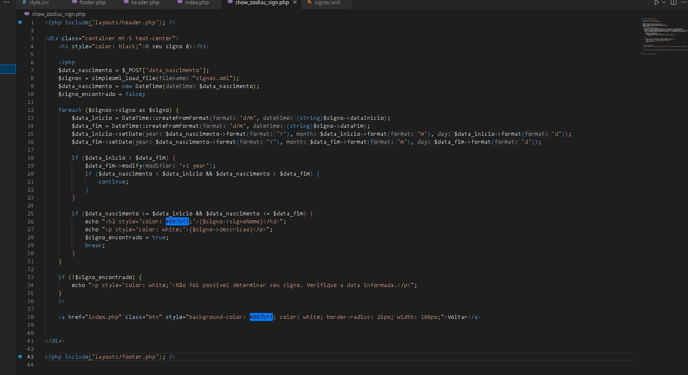
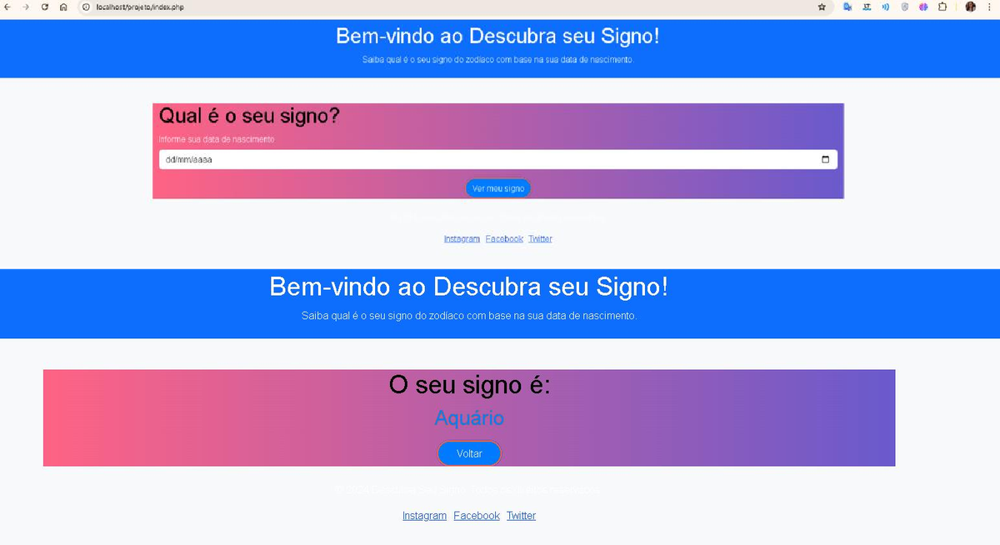

# ♓ Consulta de Signo Zodiacal — PHP + XML

Aplicação web **full-stack** que recebe a data de nascimento do usuário e retorna o signo zodiacal correspondente com descrição detalhada, desenvolvida com PHP, XML e Bootstrap.

Projeto desenvolvido como atividade prática da disciplina de **Programação Web** no curso de Tecnólogo em Análise e Desenvolvimento de Sistemas.

---

## 📸 Screenshots

**Formulário de consulta**



**Resultado exibido ao usuário**



---

## ✨ Funcionalidades

- Formulário HTML para inserção da data de nascimento
- Back-end PHP que processa e compara datas com dados em XML
- Exibição do signo com nome e descrição completa
- Interface responsiva com Bootstrap
- Estrutura de projeto organizada em pastas

---

## 🗂️ Estrutura do Projeto

```
zodiac-sign-lookup/
├── index.php               → formulário principal
├── show_zodiac_sign.php    → lógica de consulta e resultado
├── signos.xml              → dados dos 12 signos
├── assets/
│   ├── css/style.css
│   ├── signo_app.jpeg
│   └── signo_resultado.png
└── layouts/
    └── header.php
```

---

## ✨ Destaques Técnicos

- `simplexml_load_file()` para leitura e parsing do XML
- Lógica de comparação de intervalos de datas em PHP
- Separação de responsabilidades: formulário, lógica e layout em arquivos distintos
- Estilização responsiva com Bootstrap + CSS customizado

---

## 🚀 Como executar

### Pré-requisitos
- XAMPP (ou qualquer servidor Apache + PHP)

### Passo a passo

```bash
# 1. Clone o repositório dentro da pasta htdocs do XAMPP
git clone https://github.com/gabriellesca/zodiac-sign-lookup.git

# 2. Inicie o Apache no XAMPP Control Panel

# 3. Acesse no navegador
http://localhost/zodiac-sign-lookup
```

---

## 🛠️ Tecnologias


---

## 👩‍💻 Autora

**Gabrielle Simone Cunha**

[](https://github.com/gabriellesca)
[](https://linkedin.com/in/gabrielle-simone-928062392)
[](https://gabriellesca.github.io/meu-portfolio)
